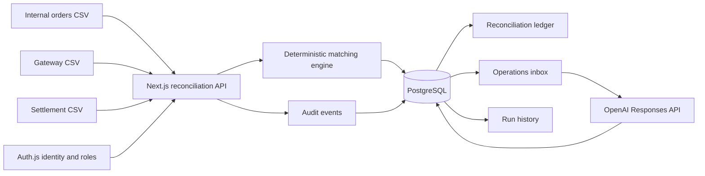

# PayOps Copilot

An evidence-first payment reconciliation workspace for Indian payment
operations teams.

PayOps Copilot compares internal orders, payment gateway transactions, and bank
settlements. It identifies missing records, duplicate captures, fee-related
amount mismatches, and pending payments without relying on AI for financial
arithmetic. Reconciliation runs and analyst workflows are persisted in
PostgreSQL.

## Why this project exists

Payment operations teams often reconcile reports with different schemas and
inconsistent identifiers. This portfolio project demonstrates how product
thinking, fintech domain knowledge, full-stack engineering, and responsible AI
principles can come together in one practical workflow.

## Full-stack workflow

- Upload three CSV reports.
- Automatically normalize common payment-report headers.
- Match orders using merchant order IDs and gateway references.
- Calculate expected settlement after MDR and GST.
- Surface actionable exceptions with row-level evidence.
- Load a built-in synthetic Indian payments dataset.
- Filter and search the reconciliation ledger.
- Inspect a transaction's evidence and suggested next step.
- Persist every reconciliation run and transaction finding in PostgreSQL.
- Automatically convert actionable exceptions into operations cases.
- Assign case owners, priorities, statuses, and investigation notes.
- Review historical runs and match-rate trends.
- Generate evidence-grounded AI investigations with structured outputs.
- Approve, reject, and rate AI suggestions before operational use.
- Isolate payment data by organization.
- Protect actions with admin, analyst, and viewer roles.
- Record important user actions in an administrator audit log.

## Architecture



The browser parses CSV files and sends their rows to a Next.js route handler.
The server normalizes aliases, performs deterministic calculations, and writes
the run, findings, and operations cases to PostgreSQL in one transaction.

## Run locally

```bash
npm install
cp .env.example .env.local
npm run db:up
npm run db:migrate
npm run db:seed
npm run dev -- --port 4317
```

Open `http://127.0.0.1:4317` and sign in with one of these fictional users.
All three accounts use the password `PayOpsDemo123!`.

| Persona | Email | What they can do |
| --- | --- | --- |
| Admin | `admin@payops.local` | Run reconciliation, manage cases, review AI work, and inspect the audit log |
| Analyst | `analyst@payops.local` | Run reconciliation, manage cases, and review AI work |
| Viewer | `viewer@payops.local` | Read dashboards, cases, and run history without changing data |

Start as the admin, select **Load demo data**, and run the reconciliation. Open
**Operations** to see the exceptions become cases, then generate and review an
investigation. Open **Audit** to see the actions recorded. Sign in as the viewer
to experience the same product with read-only controls.

The local database runs PostgreSQL 17 in Docker on port `5438`. Stop it with:

```bash
npm run db:down
```

## API surface

- `POST /api/reconcile` — reconcile reports and persist a run.
- `GET /api/runs` — list persisted reconciliation runs.
- `GET /api/cases` — list operations cases with transaction evidence.
- `PATCH /api/cases/:id` — update owner, priority, status, and notes.
- `POST /api/cases/:id/investigations` — generate and persist an investigation.
- `PATCH /api/investigations/:id` — approve, reject, or rate an investigation.
- `GET /api/audit` — list organization audit events for administrators.
- `/api/auth/*` — Auth.js sign-in, sign-out, and session endpoints.
- `GET /api/health` — verify application and database connectivity.

Except for health checks and sign-in, application routes require an
authenticated user. Reads are scoped to the user's organization. Mutations
require the `admin` or `analyst` role, and audit access requires `admin`.

## Data model

- `reconciliation_runs` stores report-level metrics and source metadata.
- `reconciliation_items` stores row-level matching results and evidence.
- `operations_cases` stores the analyst workflow for actionable exceptions.
- `ai_investigations` stores structured findings, approvals, and feedback.
- `organizations` and `users` provide workspace identity and roles.
- `audit_events` stores who performed important operational actions.
- `schema_migrations` records applied SQL migrations.

## Production deployment

Provision PostgreSQL through Neon, Supabase, Render, Railway, AWS RDS, or
another managed provider. Set `DATABASE_URL`, run `npm run db:migrate` during
release, and deploy the Next.js application. Keep database credentials in the
deployment platform's encrypted environment settings.

Set a long random `AUTH_SECRET` in every deployed environment. Replace the
fictional seed accounts with an enterprise identity provider before handling
real operational data.

Set `OPENAI_API_KEY` to enable GPT-5.5 investigations through the Responses API.
Without a key, the application uses a clearly labeled deterministic
evidence-rules fallback so the portfolio demo remains functional.

## Quality checks

```bash
npm run lint
npm test
npm run build
```

## Repository guide

- `app/` — Next.js pages, styling, and API route
- `components/` — interactive reconciliation workspace
- `db/migrations/` — versioned PostgreSQL schema
- `lib/` — database pool, repository, types, matching logic, and tests
- `scripts/` — database migration runner
- `public/demo/` — fictional CSV reports safe for a public portfolio
- `docs/PRODUCT_REQUIREMENTS.md` — MVP product requirements
- `docs/PAYMENTS_GLOSSARY.md` — plain-language payment terminology

## Product principles

1. Evidence before explanation.
2. Deterministic arithmetic for financial values.
3. Human approval for operational actions.
4. Never silently discard an uploaded row.
5. Synthetic data by default for the public portfolio.

## Roadmap

- Add SLA due dates and operational notifications.
- Build an evaluation set from analyst investigation feedback.
- Include refunds, chargebacks, and webhook timelines.
- Turn analyst corrections into repeatable AI evaluations.
- Add tamper-evident audit retention and production observability.

## Safety

This project uses fictional data. It does not initiate payments, store payment
credentials, or connect to production payment systems.
