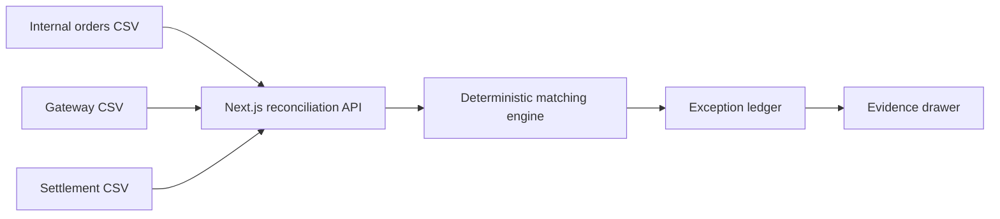

# PayOps Copilot

An evidence-first payment reconciliation workspace for Indian payment
operations teams.

PayOps Copilot compares internal orders, payment gateway transactions, and bank
settlements. It identifies missing records, duplicate captures, fee-related
amount mismatches, and pending payments without relying on AI for financial
arithmetic.

## Why this project exists

Payment operations teams often reconcile reports with different schemas and
inconsistent identifiers. This portfolio project demonstrates how product
thinking, fintech domain knowledge, full-stack engineering, and responsible AI
principles can come together in one practical workflow.

## Current MVP

- Upload three CSV reports.
- Automatically normalize common payment-report headers.
- Match orders using merchant order IDs and gateway references.
- Calculate expected settlement after MDR and GST.
- Surface actionable exceptions with row-level evidence.
- Load a built-in synthetic Indian payments dataset.
- Filter and search the reconciliation ledger.
- Inspect a transaction's evidence and suggested next step.

## Architecture



The browser parses CSV files and sends their rows to a Next.js route handler.
The server normalizes aliases, performs deterministic calculations, and
returns structured findings. Uploaded data is not persisted in this release.

## Run locally

```bash
npm install
npm run dev
```

Open `http://localhost:3000` and select **Load demo data**.

## Quality checks

```bash
npm run lint
npm test
npm run build
```

## Repository guide

- `app/` — Next.js pages, styling, and API route
- `components/` — interactive reconciliation workspace
- `lib/` — types, matching logic, and unit tests
- `public/demo/` — fictional CSV reports safe for a public portfolio
- `docs/PRODUCT_REQUIREMENTS.md` — MVP product requirements
- `docs/PAYMENTS_GLOSSARY.md` — plain-language payment terminology

## Product principles

1. Evidence before explanation.
2. Deterministic arithmetic for financial values.
3. Human approval for operational actions.
4. Never silently discard an uploaded row.
5. Synthetic data by default for the public portfolio.

## Roadmap

- Persist reconciliation runs and analyst decisions.
- Add an operations inbox with owners and SLAs.
- Add an AI investigator that cites source rows.
- Include refunds, chargebacks, and webhook timelines.
- Turn analyst corrections into repeatable AI evaluations.
- Add role-based access, audit logs, and production observability.

## Safety

This project uses fictional data. It does not initiate payments, store payment
credentials, or connect to production payment systems.
