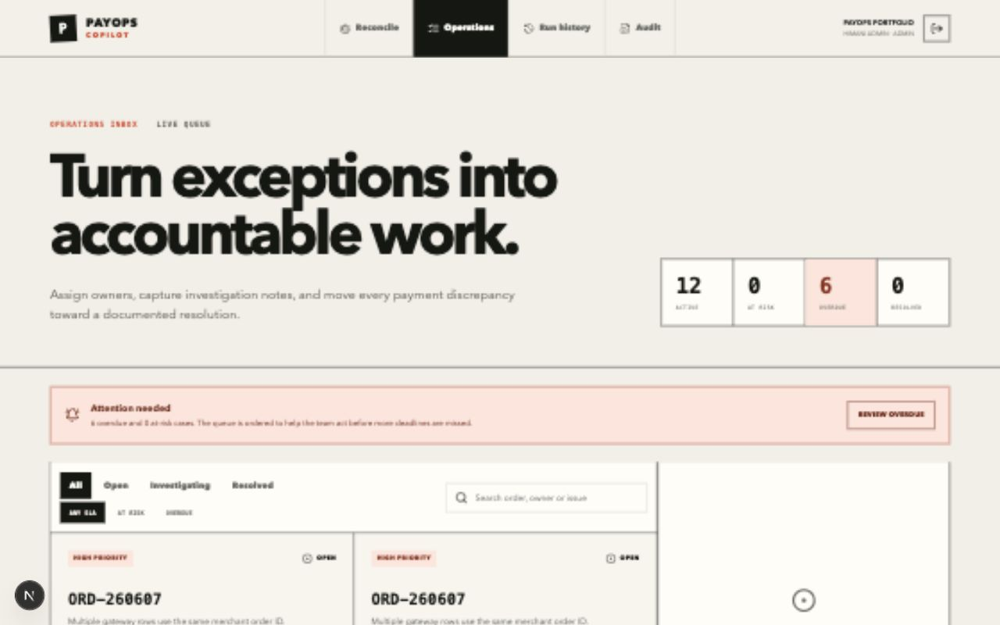
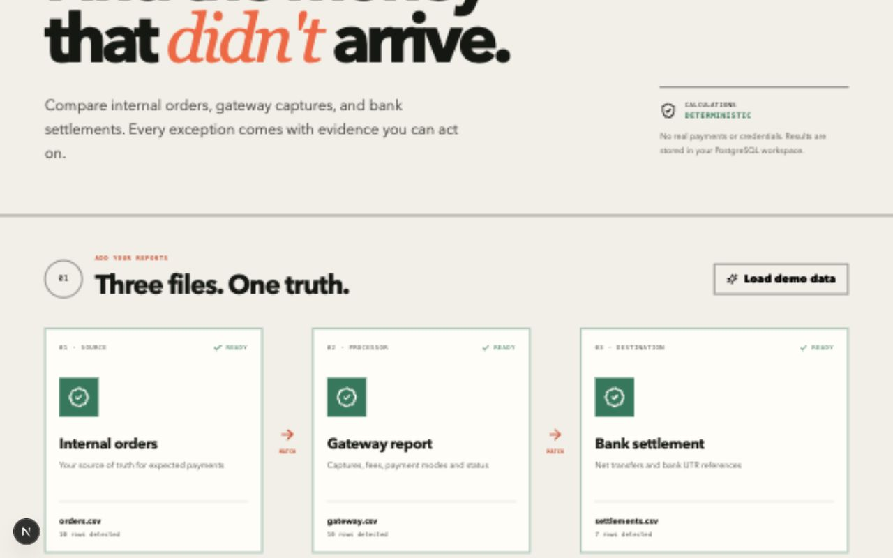
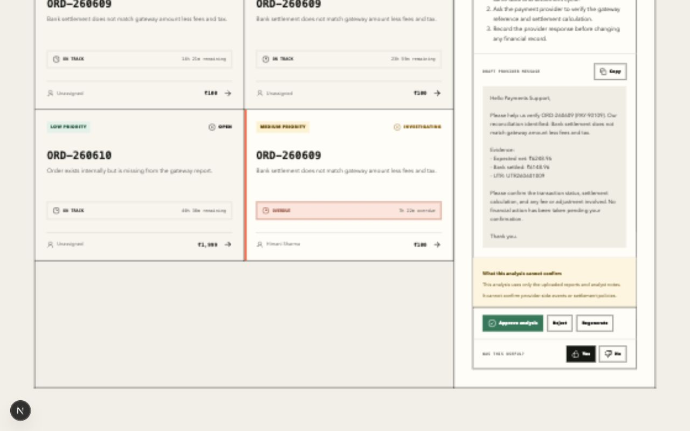
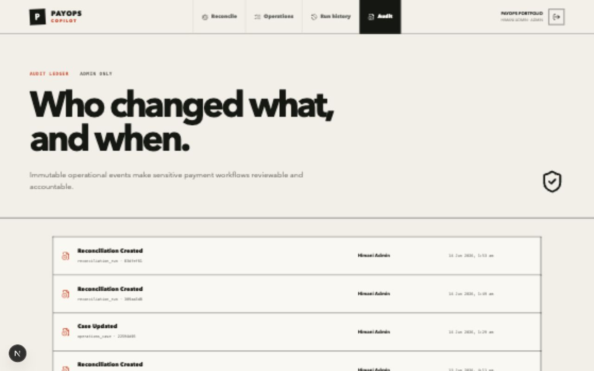
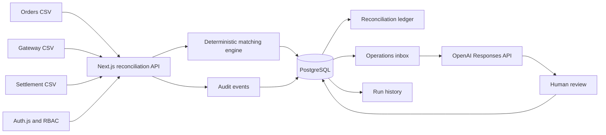

# PayOps Copilot


> An evidence-first payment reconciliation and operations workspace for Indian
> payment teams. Deterministic code calculates the money; AI helps investigate
> exceptions; humans retain decision authority.



## The headline

| | |
| --- | --- |
| **Problem** | Operations teams compare internal orders, gateway exports, and bank settlements across inconsistent spreadsheets |
| **Product** | A full-stack workspace that reconciles reports, creates cases, tracks SLAs, and records an audit trail |
| **AI role** | Produce structured, evidence-grounded investigation drafts; never calculate settlement truth or initiate money movement |
| **Human role** | Assign, investigate, approve or reject AI analysis, resolve, and remain accountable |
| **Stack** | Next.js 16, React 19, PostgreSQL 17, Auth.js, OpenAI Responses API, Zod, Vitest |
| **Build evidence** | 5 milestones, 55 tracked files, 9 API routes, 4 migrations, and 8 tests at the Phase 1 documentation snapshot |

## Why this exists

Payment reconciliation is often treated as a spreadsheet problem. The harder
product problem begins after a mismatch is found:

- Is the exception real or caused by incompatible report schemas?
- What evidence should an analyst inspect?
- Who owns the case and when is it due?
- Can an AI assistant help without inventing payment events?
- Can every important action be reconstructed later?

PayOps Copilot turns that sequence into one auditable workflow. It is a
portfolio project built from fictional Indian payment data; it does not connect
to production gateways or move money.

## See the journey

<table>
  <tr>
    <td width="50%"><br/><sub><b>Reconcile</b> - normalize three reports and calculate exceptions deterministically</sub></td>
    <td width="50%"><br/><sub><b>Operate</b> - prioritize cases using ownership, status, evidence, and SLA deadlines</sub></td>
  </tr>
  <tr>
    <td width="50%"><br/><sub><b>Investigate</b> - generate a bounded draft that requires human review</sub></td>
    <td width="50%"><br/><sub><b>Audit</b> - record who performed important operational actions</sub></td>
  </tr>
</table>

## What the product does

1. Accepts internal-order, gateway-transaction, and bank-settlement CSV files.
2. Normalizes common header aliases without silently discarding rows.
3. Matches records using merchant order IDs and gateway references.
4. Calculates expected net settlement after gateway fees and GST.
5. Detects missing gateway rows, duplicate captures, missing settlements,
   pending payments, and amount mismatches.
6. Persists reconciliation runs and row-level evidence in PostgreSQL.
7. Converts actionable exceptions into organization-scoped operations cases.
8. Supports admin, analyst, and read-only viewer roles.
9. Applies 4-hour, 24-hour, and 72-hour SLAs by priority.
10. Generates structured AI investigations with approval and feedback controls.
11. Records reconciliation, case, and investigation actions in an audit ledger.

## The product judgment

The central design decision is to separate **financial truth** from
**investigation assistance**:

```text
CSV facts -> deterministic normalization and arithmetic -> persisted evidence
                                                    |
                                                    v
                              AI explanation and provider-message draft
                                                    |
                                                    v
                                      human approval or rejection
```

The OpenAI path receives only the selected case evidence and analyst notes. Its
structured output is validated with Zod. If no API key is configured, a clearly
labeled deterministic evidence-rules fallback keeps the demo usable. Neither
path can initiate refunds, edit financial records, or contact a provider.

See [AI investigation design](docs/portfolio/ARCHITECTURE.md#5-bounded-ai-investigation)
and the implementation in [`lib/ai-investigator.ts`](lib/ai-investigator.ts).

## Architecture



The server owns reconciliation, persistence, authorization, and audit writes.
The browser owns CSV parsing and interaction state. Every protected read is
scoped to the signed-in organization; operational mutations require an admin
or analyst.

Read the design rationale in
[Architecture](docs/portfolio/ARCHITECTURE.md) and
[Roadmap and trade-offs](docs/portfolio/ROADMAP-AND-TRADEOFFS.md).

## Run locally

```bash
npm install
cp .env.example .env.local
npm run db:up
npm run db:migrate
npm run db:seed
npm run dev -- --hostname 127.0.0.1 --port 4317
```

Open `http://127.0.0.1:4317`.

| Persona | Email | Access |
| --- | --- | --- |
| Admin | `admin@payops.local` | Reconcile, manage cases, review AI work, inspect audit |
| Analyst | `analyst@payops.local` | Reconcile, manage cases, review AI work |
| Viewer | `viewer@payops.local` | Read dashboards, cases, and history |

All fictional demo accounts use `PayOpsDemo123!`.

For the five-minute walkthrough, use the
[Demo Guide](docs/portfolio/DEMO-GUIDE.md).

## API and data

| Method | Route | Purpose |
| --- | --- | --- |
| `POST` | `/api/reconcile` | Reconcile reports and persist a run |
| `GET` | `/api/runs` | List organization run history |
| `GET` | `/api/cases` | List organization operations cases |
| `PATCH` | `/api/cases/:id` | Update status, owner, priority, or notes |
| `POST` | `/api/cases/:id/investigations` | Generate an investigation |
| `PATCH` | `/api/investigations/:id` | Review or rate an investigation |
| `GET` | `/api/audit` | List audit events for administrators |
| `GET` | `/api/health` | Check application and database health |

PostgreSQL stores organizations, users, reconciliation runs, row-level items,
operations cases, AI investigations, audit events, and migration history.

## Quality and safety

```bash
npm run lint
npm test
npm run build
```

The current suite covers reconciliation behavior, deterministic investigation
fallbacks, and SLA policy. Portfolio claims are intentionally bounded:

- all data is synthetic;
- no production payment provider is connected;
- no payment credentials are stored;
- no money movement is implemented;
- AI output is assistance, not settlement truth;
- real deployment would require enterprise identity, secrets management,
  observability, retention controls, and a labeled AI evaluation set.

## How Codex was used

Codex acted as a repository-aware implementation partner, not as an
unreviewed code generator. The recurring workflow was:

```text
payments problem -> inspect repository -> propose product slice
-> implement database/API/UI -> lint and test -> run production build
-> walk the real browser journey -> review git diff -> commit and push
```

The human supplied payment-domain context, selected priorities, authorized
GitHub actions, and reviewed the working product. Codex inspected files,
implemented across layers, operated PostgreSQL migrations, drove the local
browser, and verified role-specific journeys.

The detailed chronology and lessons are in [Build Story](BUILD-STORY.md).
This follows current Codex guidance to provide clear goals, context,
constraints, and completion conditions; encode durable repository guidance in
`AGENTS.md`; and verify changes with tests, review, and browser checks
([official Codex best practices](https://developers.openai.com/codex/learn/best-practices)).

## Documentation

| Document | Question it answers |
| --- | --- |
| [Build Story](BUILD-STORY.md) | How did a non-technical payments PM build this with Codex? |
| [Product Case Study](docs/portfolio/PRODUCT-CASE-STUDY.md) | What problem, user, bet, and outcome does the product represent? |
| [Demo Guide](docs/portfolio/DEMO-GUIDE.md) | How can a reviewer understand the product in five minutes? |
| [Architecture](docs/portfolio/ARCHITECTURE.md) | How do reconciliation, PostgreSQL, RBAC, SLA, AI, and audit fit together? |
| [By the Numbers](docs/portfolio/BY-THE-NUMBERS.md) | Which project claims are measured and where is the evidence? |
| [Roadmap and Trade-offs](docs/portfolio/ROADMAP-AND-TRADEOFFS.md) | What was deliberately chosen, deferred, and accepted? |
| [Product Requirements](docs/PRODUCT_REQUIREMENTS.md) | What did the MVP need to achieve? |
| [Payments Glossary](docs/PAYMENTS_GLOSSARY.md) | What do the payment terms mean? |

## Roadmap

- Build a golden evaluation set from analyst ratings and corrections.
- Add refunds, chargebacks, and webhook event timelines.
- Add configurable business calendars and escalation notifications.
- Add provider-specific investigation tools with scoped permissions.
- Add tamper-evident audit retention and production observability.

---

**Built by Himani Sharma** - AI Product Manager portfolio project combining
Indian payment-operations experience, full-stack product delivery, and
human-governed AI.
