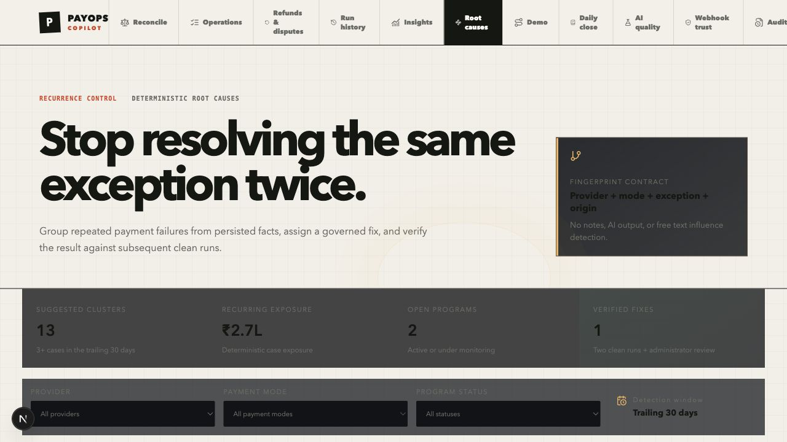
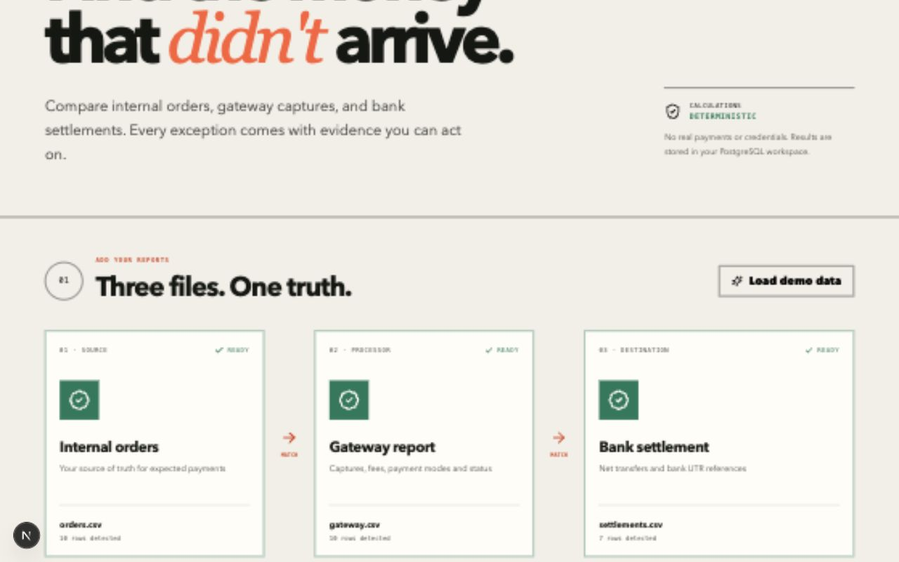
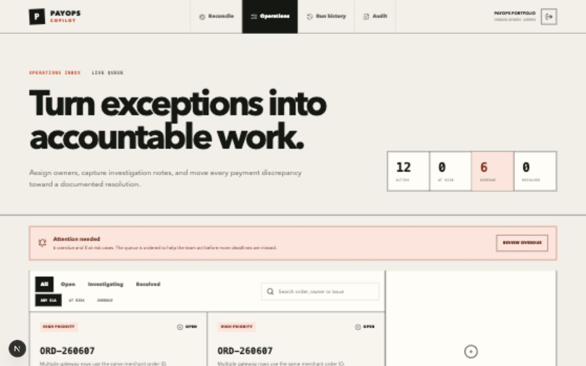
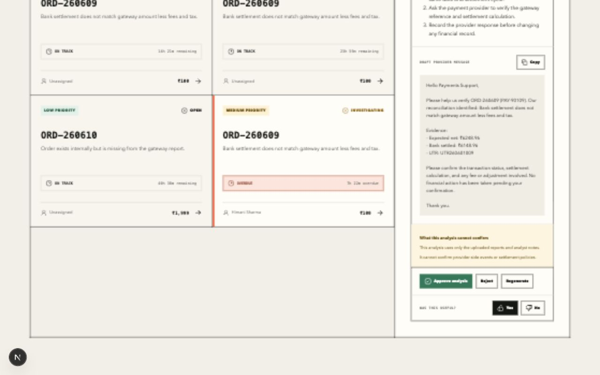
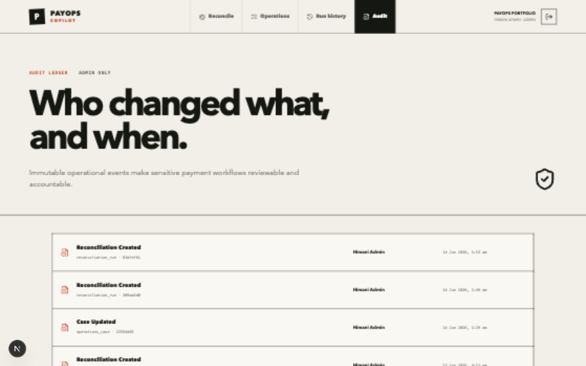
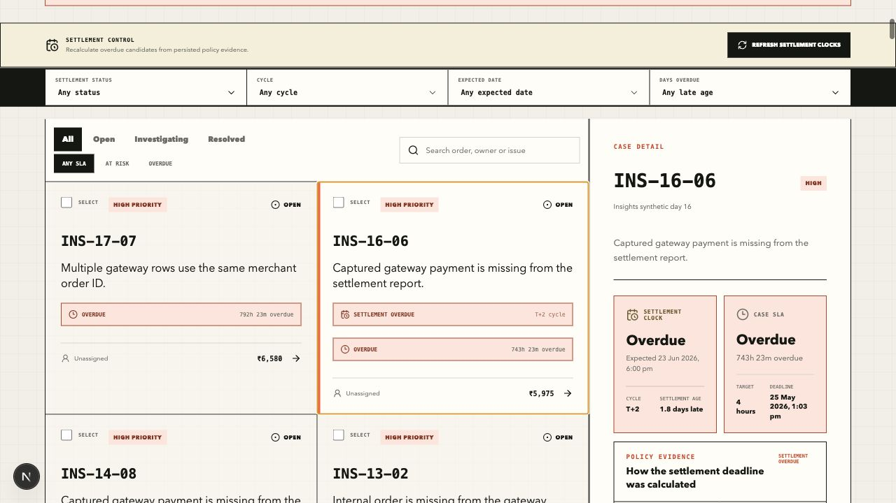
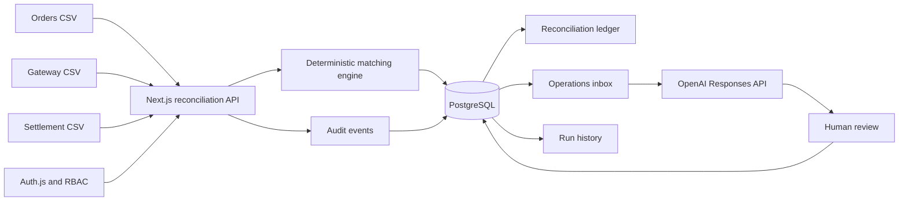

# PayOps Copilot


> An evidence-first payment reconciliation and operations workspace for Indian
> payment teams. Deterministic code calculates the money; AI helps investigate
> exceptions; humans retain decision authority.



## The headline

| | |
| --- | --- |
| **Problem** | Operations teams compare internal orders, gateway exports, and bank settlements across inconsistent spreadsheets |
| **Product** | A full-stack workspace that profiles provider files, reconciles reports, creates cases, tracks SLAs, and records an audit trail |
| **AI role** | Produce structured, evidence-grounded investigation drafts; never calculate settlement truth or initiate money movement |
| **Human role** | Assign, investigate, approve or reject AI analysis, resolve, and remain accountable |
| **Stack** | Next.js 16, React 19, PostgreSQL 17, Auth.js, OpenAI Responses API, Zod, Vitest |
| **Backend shape** | Modular monolith with thin routes, domain services, twelve repositories, and shared PostgreSQL infrastructure |
| **Build evidence** | 21 product milestones, 27 API routes, 18 migrations, and 88 unit/integration tests at the Root-Cause Programs snapshot |

## Why this exists

Payment reconciliation is often treated as a spreadsheet problem. The harder
product problem begins after a mismatch is found:

- Is the exception real or caused by incompatible report schemas?
- What evidence should an analyst inspect?
- Who owns the case and when is it due?
- Can an AI assistant help without inventing payment events?
- Can every important action be reconstructed later?

PayOps Copilot turns that sequence into one auditable workflow. It is a
portfolio project built from fictional Indian payment data; it does not connect
to production gateways or move money.

## See the journey

<table>
  <tr>
    <td width="50%"><br/><sub><b>Reconcile</b> - normalize three reports and calculate exceptions deterministically</sub></td>
    <td width="50%"><br/><sub><b>Operate</b> - prioritize cases using ownership, status, evidence, and SLA deadlines</sub></td>
  </tr>
  <tr>
    <td width="50%"><br/><sub><b>Investigate</b> - generate a bounded draft that requires human review</sub></td>
    <td width="50%"><br/><sub><b>Audit</b> - record who performed important operational actions</sub></td>
  </tr>
  <tr>
    <td width="50%"><br/><sub><b>Control</b> - explain exactly which cycle and calendar rule produced the settlement deadline</sub></td>
    <td width="50%"><br/><sub><b>Improve</b> - turn recurring exceptions into governed remediation programs with two clean-run verification</sub></td>
  </tr>
</table>

## What the product does

1. Accepts internal-order, gateway-transaction, and bank-settlement CSV files.
2. Profiles generic, Razorpay-style, Cashfree-style, and PayU-style synthetic
   report formats before matching.
3. Normalizes common and provider-specific header aliases without silently
   discarding rows.
4. Matches records using merchant order IDs and gateway references.
5. Calculates expected net settlement after gateway fees and GST.
6. Detects missing gateway rows, duplicate captures, missing settlements,
   pending payments, and amount mismatches.
7. Persists minimal order, gateway, and settlement source-row snapshots with
   original row numbers, normalized values, and SHA-256 integrity hashes.
8. Converts actionable exceptions into organization-scoped operations cases.
9. Supports admin, analyst, and read-only viewer roles.
10. Applies 4-hour, 24-hour, and 72-hour SLAs by priority.
11. Generates structured AI investigations with approval and feedback controls.
12. Records reconciliation, case, and investigation actions in an audit ledger.
13. Runs a 30-case synthetic AI-quality baseline with versioned prompt metadata.
14. Persists organization-scoped evaluation runs, scenario results, and audit evidence.
15. Stores case-level outputs and supports two independently assigned reviewers,
    disagreement visibility, administrator adjudication, and aggregate human
    scores.
16. Runs the same 30-case suite against OpenAI on explicit request and records
    latency and token usage at run and case level.
17. Manages synthetic refunds and chargebacks as separate deadline-driven
    lifecycles with evidence gates, timelines, ownership, and audit events.
18. Normalizes synthetic provider webhook payloads into case and workflow
    timelines with explicit "proves / does not prove" boundaries.
19. Requires an attributed resolution reason and explicit source-evidence
    confirmation before an operations case can be resolved.
20. Accepts HMAC-signed synthetic provider events through an idempotent,
    organization-scoped boundary that stores hashes and normalized evidence,
    never raw payloads.
21. Surfaces matched provider evidence and deterministic SLA risk in a
    role-aware in-app notification center.
22. Provides manager-focused Operations Intelligence with period comparisons,
    queue health, exception mix, aging, provider performance, governed AI
    evidence, and URL-backed drill-down into underlying cases.
23. Supports atomic bulk case assignment and attributed, append-only internal
    comments with organization scoping, role controls, and audit evidence.
24. Calculates fictional provider/payment-mode settlement cycles in IST,
    defers premature missing-settlement cases, and promotes overdue records
    through an audited idempotent refresh.
25. Verifies fictional provider-specific signature contracts with active and
    previous keys, records hash-only attempt outcomes, and gives administrators
    a tenant-scoped webhook trust ledger.
26. Converts a provider/payment-mode business day into an immutable close
    snapshot with materiality controls, residual-risk dispositions,
    analyst/administrator maker-checker approval, controlled reopening, and a
    downloadable synthetic certificate.
27. Detects recurring exception fingerprints from deterministic records,
    promotes them into owned remediation programs, automatically links future
    matching cases, and lets an administrator verify two subsequent clean runs.
28. Adds a reviewer-focused Control Room Demo Mode that links the core
    PayOps evidence journey into a 90-second synthetic portfolio walkthrough.

## The product judgment

The central design decision is to separate **financial truth** from
**investigation assistance**:

```text
CSV facts -> deterministic normalization and arithmetic -> persisted evidence
                                                    |
                                                    v
                              AI explanation and provider-message draft
                                                    |
                                                    v
                                      human approval or rejection
```

The OpenAI path receives only the selected case evidence and analyst notes. Its
structured output is validated with Zod. If no API key is configured, a clearly
labeled deterministic evidence-rules fallback keeps the demo usable. Neither
path can initiate refunds, edit financial records, or contact a provider.

See [AI investigation design](docs/portfolio/ARCHITECTURE.md#7-bounded-ai-investigation)
and the implementation in [`lib/ai-investigator.ts`](lib/ai-investigator.ts).

## Architecture


```mermaid
flowchart LR
    A[Orders CSV] --> D[Next.js reconciliation API]
    B[Gateway CSV] --> D
    C[Settlement CSV] --> D
    D --> E[Deterministic matching engine]
    E --> F[(PostgreSQL)]
    F --> G[Reconciliation ledger]
    F --> H[Operations inbox]
    F --> I[Run history]
    H --> J[OpenAI Responses API]
    J --> K[Human review]
    K --> F
    L[Auth.js and RBAC] --> D
    D --> M[Audit events]
    M --> F
```

The server owns reconciliation, persistence, authorization, and audit writes.
The browser owns CSV parsing and interaction state. Every protected read is
scoped to the signed-in organization; operational mutations require an admin
or analyst.

Read the design rationale in
[Architecture](docs/portfolio/ARCHITECTURE.md) and
[Roadmap and trade-offs](docs/portfolio/ROADMAP-AND-TRADEOFFS.md).

## Run locally

```bash
npm install
cp .env.example .env.local
npm run db:up
npm run db:migrate
npm run db:seed
npm run dev -- --hostname 127.0.0.1 --port 4317
```

Open `http://127.0.0.1:4317`.

| Persona | Email | Access |
| --- | --- | --- |
| Admin | `admin@payops.local` | Reconcile, manage cases, review AI work, inspect audit |
| Analyst | `analyst@payops.local` | Reconcile, manage cases, review AI work |
| Viewer | `viewer@payops.local` | Read dashboards, cases, and history |

All fictional demo accounts use `PayOpsDemo123!`.

For the five-minute walkthrough, use the
[Demo Guide](docs/portfolio/DEMO-GUIDE.md).

## API and data

| Method | Route | Purpose |
| --- | --- | --- |
| `POST` | `/api/reconcile` | Reconcile reports and persist a run |
| `GET` | `/api/runs` | List organization run history |
| `GET` | `/api/cases` | List organization operations cases |
| `PATCH` | `/api/cases/:id` | Update case controls or save an evidence-backed resolution |
| `PATCH` | `/api/cases/bulk` | Assign or unassign up to 100 organization-owned cases atomically |
| `GET/POST` | `/api/cases/:id/comments` | Read or append attributed internal handoff comments |
| `POST` | `/api/settlement-control/refresh` | Promote newly overdue organization settlements into cases |
| `GET/POST` | `/api/close-controls` | Inspect readiness or submit an immutable daily close version |
| `PATCH` | `/api/close-controls/:id` | Approve or administratively reopen a close period |
| `GET` | `/api/close-controls/:id/certificate` | Download an approved synthetic close certificate |
| `POST` | `/api/cases/:id/investigations` | Generate an investigation |
| `PATCH` | `/api/investigations/:id` | Review or rate an investigation |
| `GET` | `/api/audit` | List audit events for administrators |
| `GET/POST` | `/api/evaluations` | List or run deterministic or guarded OpenAI evaluations |
| `GET/PATCH` | `/api/evaluations/:id` | Inspect a run or claim one of two reviewer slots |
| `PATCH` | `/api/evaluations/:id/cases/:caseId` | Save an independent review or admin adjudication |
| `GET` | `/api/payment-workflows` | List organization refund and chargeback workflows |
| `PATCH` | `/api/payment-workflows/:id` | Update stage, owner, evidence, priority, or notes |
| `POST` | `/api/provider-webhooks/:providerId` | Receive a signed synthetic provider event |
| `GET` | `/api/provider-webhooks/observability` | Inspect administrator-only webhook trust evidence |
| `GET` | `/api/notifications` | List organization-scoped provider and SLA signals |
| `PATCH` | `/api/notifications/:id` | Mark a notification read as admin or analyst |
| `GET` | `/api/insights` | Return deterministic organization-scoped operations metrics |
| `GET/POST` | `/api/remediation-programs` | List recurrence suggestions and explicitly promote a governed program |
| `GET/PATCH` | `/api/remediation-programs/:id` | Inspect evidence or manage the program lifecycle |
| `GET` | `/api/health` | Check application and database health |

The synthetic webhook route requires `x-payops-organization`,
`x-payops-event-id`, and `x-payops-signature`. Its JSON body is
`{ eventType, occurredAt, payload }`. Legacy demo requests use HMAC-SHA256 over
`organizationSlug.externalEventId.exactBody` with
`SYNTHETIC_WEBHOOK_SECRET`. The fictional `provider-v2` contract adds
`x-payops-signature-version`, `x-payops-key-id`, and, for the Cashfree-style
demo, `x-payops-timestamp`; active and previous keys come from
`SYNTHETIC_WEBHOOK_KEYRING`. These contracts intentionally do not reproduce
production-provider schemes.

PostgreSQL stores organizations, users, reconciliation runs, row-level items,
source-evidence snapshots and hashes, operations cases, append-only comments, and resolution records,
AI investigations, evaluation runs, scenario-level results, case-level outputs
and reviews, refund and chargeback workflows, decision timelines, audit events,
normalized provider events, hash-only webhook attempt evidence, and migration
history. Daily close periods retain immutable snapshot versions, maker/checker
attribution, residual-risk dispositions, reopen reasons, and hashes.

## Quality and safety

```bash
npm run verify
```

The verification command runs lint, 72 unit/policy tests, sixteen PostgreSQL-backed
integration tests, a production build, and `git diff --check`. GitHub
Actions runs the same command against a clean PostgreSQL 17 service.

The current suite covers reconciliation, deterministic investigations, SLA
policy, payment-lifecycle rules, domain-service validation, and the 30-case
quality baseline. Portfolio claims are intentionally bounded:

- all data is synthetic;
- no production payment provider is connected;
- provider adapters are synthetic mapping policies, not live integrations;
- inbound webhook support is a synthetic-only HMAC boundary, not a live
  provider connection or production compatibility claim;
- settlement cycles and closure dates are fictional demonstration policies,
  not provider contracts or an RBI holiday calendar;
- raw webhook payloads and provider credentials are not stored;
- webhook attempt metrics describe local synthetic evidence, not provider
  uptime or production delivery reliability;
- no payment credentials are stored;
- no money movement is implemented;
- close certificates are internal synthetic evidence snapshots, not bank or
  provider attestations;
- recurring clusters use only persisted structured fields; verification means
  two observed clean runs, not proof of a permanent provider fix;
- AI output is assistance, not settlement truth;
- real deployment would require enterprise identity, secrets management,
  observability, retention controls, and production-derived evaluation data.

## How Codex was used

Codex acted as a repository-aware implementation partner, not as an
unreviewed code generator. The recurring workflow was:

```text
payments problem -> inspect repository -> propose product slice
-> implement database/API/UI -> lint and test -> run production build
-> walk the real browser journey -> review git diff -> commit and push
```

The human supplied payment-domain context, selected priorities, authorized
GitHub actions, and reviewed the working product. Codex inspected files,
implemented across layers, operated PostgreSQL migrations, drove the local
browser, and verified role-specific journeys.

The detailed chronology and lessons are in [Build Story](BUILD-STORY.md).
This follows current Codex guidance to provide clear goals, context,
constraints, and completion conditions; encode durable repository guidance in
`AGENTS.md`; and verify changes with tests, review, and browser checks
([official Codex best practices](https://developers.openai.com/codex/learn/best-practices)).

## Documentation

| Document | Question it answers |
| --- | --- |
| [Build Story](BUILD-STORY.md) | How did a non-technical payments PM build this with Codex? |
| [Product Case Study](docs/portfolio/PRODUCT-CASE-STUDY.md) | What problem, user, bet, and outcome does the product represent? |
| [Demo Guide](docs/portfolio/DEMO-GUIDE.md) | How can a reviewer understand the product in five minutes? |
| [Architecture](docs/portfolio/ARCHITECTURE.md) | How do reconciliation, PostgreSQL, RBAC, SLA, AI, and audit fit together? |
| [By the Numbers](docs/portfolio/BY-THE-NUMBERS.md) | Which project claims are measured and where is the evidence? |
| [Roadmap and Trade-offs](docs/portfolio/ROADMAP-AND-TRADEOFFS.md) | What was deliberately chosen, deferred, and accepted? |
| [AI Development System](docs/portfolio/AI-DEVELOPMENT-SYSTEM.md) | How was Codex directed, reviewed, and verified? |
| [AI Workflows and Agents](docs/portfolio/AI-WORKFLOWS-AND-AGENTS.md) | Which repeatable workflows turn feedback and messy data into product changes? |
| [AI SDLC Playbook](docs/portfolio/AI-SDLC-PLAYBOOK.md) | How should an AI payment feature move from framing to monitored release? |
| [AI Model Evaluation](docs/portfolio/AI-MODEL-EVALUATION.md) | How are investigation quality, grounding, and financial safety evaluated? |
| [Analytics Event Spec](docs/portfolio/ANALYTICS-EVENT-SPEC.md) | Which privacy-safe events and product metrics should be collected? |
| [Design System](docs/portfolio/DESIGN-SYSTEM.md) | Which operations-console patterns, tokens, and interaction rules are shared? |
| [Product Requirements](docs/PRODUCT_REQUIREMENTS.md) | What did the MVP need to achieve? |
| [Payments Glossary](docs/PAYMENTS_GLOSSARY.md) | What do the payment terms mean? |

## Roadmap

- Configure an API key, run the guarded OpenAI evaluation, and complete a
  representative two-reviewer sample before making a model-quality claim.
- Feed approved analyst corrections into new anonymized evaluation cases.
- Add configurable business calendars and outbound escalation channels.
- Add provider-specific investigation tools with scoped permissions.
- Add managed secrets, provider-certified signatures, tamper-evident audit
  retention, incident response, and production observability.

---

**Built by Himani Sharma** - AI Product Manager portfolio project combining
Indian payment-operations experience, full-stack product delivery, and
human-governed AI.
