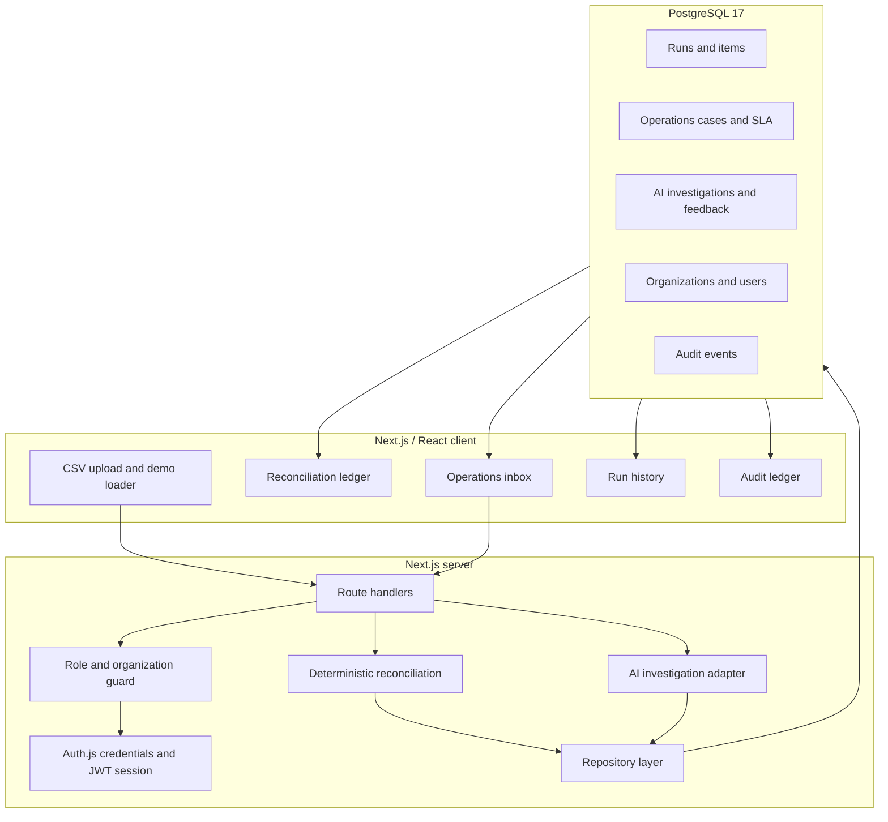

# Architecture

> The architecture is designed around one principle: financial facts must be
> reproducible, while AI suggestions must be bounded, reviewable, and optional.

## System overview

## 1. Deterministic reconciliation

`lib/reconciliation.ts` is the financial control plane.

It:

- normalizes common header aliases;
- parses currency values into numbers;
- matches gateway rows by merchant order ID;
- matches settlement rows by order ID or gateway reference;
- calculates expected net as gateway amount minus fee and tax;
- rounds financial outputs to two decimals;
- emits a typed result and source-derived evidence.

AI is not imported into this module. The same inputs produce the same outputs.

## 2. Transactional persistence

`lib/repository.ts` writes a reconciliation run, its row-level items, and its
operations cases inside one database transaction. If persistence fails, the
workflow does not leave a partially written run.

The migration chain is append-only:

| Migration | Capability |
| --- | --- |
| `001_initial.sql` | Runs, items, cases, indexes |
| `002_ai_investigations.sql` | Structured investigations and human feedback |
| `003_identity_and_audit.sql` | Organizations, users, scoping, audit events |
| `004_case_sla.sql` | Backfilled deadlines and SLA query index |

## 3. Identity, organization, and roles

Auth.js credentials authentication provides a JWT-backed session for the local
portfolio demo. Every protected route calls `requireActor`.

| Role | Read | Reconcile | Update cases | Review AI | Audit |
| --- | --- | --- | --- | --- | --- |
| Admin | Yes | Yes | Yes | Yes | Yes |
| Analyst | Yes | Yes | Yes | Yes | No |
| Viewer | Yes | No | No | No | No |

Repository reads and writes receive `organizationId`, and SQL predicates scope
records to that organization. UI controls are disabled for viewers, but the
server guard remains authoritative.

## 4. SLA as policy

`lib/sla.ts` centralizes the deadline policy:

- high priority: 4 hours;
- medium priority: 24 hours;
- low priority: 72 hours.

The policy classifies active work as on track, at risk, or overdue, and resolved
work as met or breached. The database stores `due_at` and `resolved_at`; the
frontend derives live labels from those timestamps.

Changing priority recalculates the deadline from the original case creation
time. The update is included in the audit details.

## 5. Bounded AI investigation

`lib/ai-investigator.ts` is deliberately downstream of deterministic evidence.

### Input

- case ID and payment identifiers;
- payment mode and amounts;
- deterministic reconciliation status;
- evidence strings;
- analyst notes.

### Output

A Zod-validated object containing:

- likely cause;
- confidence;
- supporting evidence;
- recommended actions;
- provider-message draft;
- explicit limitations.

### Guardrails

- The prompt forbids invented events, policies, provider responses, and money
  movement.
- Input financial calculations are declared authoritative.
- Provider messages request confirmation rather than assign fault.
- The Responses API call uses `store: false`.
- No API key produces a visible deterministic fallback.
- The UI requires human approval or rejection.
- The system has no tool for refunds, payouts, or financial-record changes.

This is an assistance workflow, not an autonomous agent.

## 6. Auditability

Important mutations call `recordAuditEvent` with:

- organization;
- actor user and name;
- action;
- entity type and ID;
- structured details;
- timestamp.

Current audited actions include reconciliation creation, case updates,
investigation generation, and investigation review. The administrator ledger
is organization-scoped.

## 7. Frontend structure

- `components/payops-workspace.tsx`: upload, demo data, reconciliation results.
- `components/operations-inbox.tsx`: queue, case detail, SLA, AI review.
- `components/run-history.tsx`: historical quality and value metrics.
- `components/audit-log.tsx`: admin audit ledger.
- `components/app-header.tsx`: role-aware product navigation.

The visual language intentionally resembles an operations console: dense
evidence, compact labels, visible control states, and restrained color for
urgency.

## Failure behavior

| Failure | Product behavior |
| --- | --- |
| Missing required reports | Reconciliation API returns validation error |
| Database unavailable | API returns a service error; health endpoint fails |
| Unauthenticated request | `401` |
| Role lacks permission | `403` |
| Organization does not own entity | Not found or unchanged |
| OpenAI key absent | Deterministic fallback |
| Model output fails schema | Investigation request fails instead of storing malformed output |

## Production evolution

A real deployment should add:

- enterprise identity and user lifecycle;
- managed PostgreSQL backups and connection pooling;
- encrypted object storage for original reports if retention is required;
- secrets management and key rotation;
- structured tracing, metrics, and alerts;
- idempotency and asynchronous processing for large files;
- configurable business calendars and escalation channels;
- a versioned AI evaluation set and prompt/model release gates.

---

[Back to README](../../README.md) |
[Product Case Study](PRODUCT-CASE-STUDY.md) |
[Roadmap and Trade-offs](ROADMAP-AND-TRADEOFFS.md)
