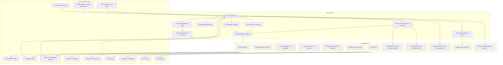

# Architecture

> The architecture is designed around one principle: financial facts must be
> reproducible, while AI suggestions must be bounded, reviewable, and optional.

## System overview


```mermaid
flowchart TB
    subgraph Client["Next.js / React client"]
      Upload[CSV upload and demo loader]
      ProviderUI[Provider adapter and data-quality report]
      Ledger[Reconciliation ledger]
      Ops[Operations inbox]
      Lifecycles[Refund and chargeback queues]
      ProviderEvents[Provider event timelines]
      WebhookTrust[Webhook trust ledger]
      DailyClose[Daily close control book]
      Quality[Quality Lab]
      Insights[Operations Intelligence]
      History[Run history]
      AuditUI[Audit ledger]
    end

    subgraph Server["Next.js server"]
      Auth[Auth.js credentials and JWT session]
      Routes[Route handlers]
      Engine[Deterministic reconciliation]
      ProviderPolicy[Provider mapping policies]
      WebhookPolicy[Signed synthetic webhook boundary]
      Notifications[Operational notification service]
      Investigator[AI investigation adapter]
      Access[Role and organization guard]
      Modules[Domain backend modules]
    end

    subgraph Data["PostgreSQL 17"]
      Runs[Runs and items]
      Cases[Operations cases and SLA]
      AI[AI investigations and feedback]
      Evals[Evaluation runs and reviews]
      Workflows[Payment workflows and timelines]
      Identity[Organizations and users]
      Events[Audit events]
      ProviderStore[Webhook hashes and normalized events]
      AttemptStore[Hash-only webhook attempt evidence]
      CloseStore[Immutable close versions and dispositions]
      SignalStore[Operational notifications]
      Metrics[Deterministic aggregate queries]
    end

    Upload --> Routes
    ProviderUI --> Routes
    Routes --> Access
    Access --> Auth
    Routes --> Engine
    Routes --> ProviderPolicy
    Routes --> WebhookPolicy
    WebhookPolicy --> Modules
    Routes --> Notifications
    Routes --> Metrics
    WebhookPolicy --> ProviderStore
    WebhookPolicy --> AttemptStore
    Routes --> CloseStore
    Notifications --> SignalStore
    Engine --> Modules
    Ops --> Routes
    Lifecycles --> Routes
    ProviderEvents --> Routes
    Quality --> Routes
    Routes --> Investigator
    Investigator --> Modules
    Modules --> Data
    Data --> Ledger
    Data --> Ops
    Data --> Lifecycles
    Data --> Quality
    Data --> Insights
    Data --> History
    Data --> AuditUI
    Data --> WebhookTrust
    Data --> DailyClose
```

## 1. Deterministic reconciliation

`lib/reconciliation.ts` is the financial control plane.

It:

- applies a selected synthetic provider adapter;
- normalizes common and provider-specific header aliases;
- profiles mapped fields, invalid amounts, duplicate references, and unknown
  statuses before returning the reconciliation result;
- parses currency values into numbers;
- matches gateway rows by merchant order ID;
- matches settlement rows by order ID or gateway reference;
- calculates expected net as gateway amount minus fee and tax;
- rounds financial outputs to two decimals;
- emits a typed result, explanatory evidence, and minimal source-row snapshots;
- hashes each snapshot with SHA-256 over its source type, original row number,
  normalized values, and retained source values.

AI is not imported into this module. The same inputs produce the same outputs.

Current provider adapters live in `lib/provider-adapters.ts`:

| Adapter | Purpose |
| --- | --- |
| `generic` | The public demo CSV format and common payment-aggregator headers |
| `razorpay_demo` | Synthetic Razorpay-like payment and settlement exports |
| `cashfree_demo` | Synthetic Cashfree-like order, payment, and settlement exports |
| `payu_demo` | Synthetic PayU-like transaction and settlement exports |

These adapters are mapping policies, not live integrations. They do not use
provider credentials, call provider APIs, or claim compatibility with production
exports.

## 2. Signed synthetic provider event timelines

`lib/provider-webhooks.ts` contains fictional webhook fixtures and a
deterministic normalizer for Razorpay-style, Cashfree-style, and PayU-style
payloads.

The normalizer converts provider-specific shapes into one internal event model:

- payment captured;
- settlement processed;
- refund initiated;
- refund completed;
- chargeback received;
- chargeback evidence due.

The route `/api/provider-webhooks/:providerId` accepts only the three demo
providers. The legacy contract verifies HMAC-SHA256 over the organization
slug, external event ID, and exact request body. The fictional `provider-v2`
contract uses provider-specific canonical strings, explicit key IDs, active
and previous environment-managed keys, and a five-minute timestamp window for
the Cashfree-style demo. The database enforces idempotency per organization,
provider, and event ID.

Only a SHA-256 body hash and the normalized event are persisted. Raw payloads
are discarded. Deterministic identifier matching attaches persisted events to
tenant-owned cases and payment workflows, where the UI states both what an
event proves and what it does not prove.

Known-organization attempts also persist signature version, non-secret key ID,
key state, outcome, HTTP status, failure code, match count, and processing
time. The administrator-only `/webhook-operations` read model is scoped by
organization. It is an evidence ledger for this synthetic boundary, not a
provider uptime or delivery-success claim. Unknown organizations receive a
generic signature rejection and are not persisted.

This is an executable integration boundary, not a production-provider claim.
It has no provider credentials, outbound provider call, money-moving action,
or provider-specific production signature contract.

## 3. Transactional persistence

`lib/modules/reconciliation/repository.ts` writes a reconciliation run, its
row-level items, source-evidence snapshots, and operations cases inside one
database transaction. The reconciliation audit event is committed in that same
transaction. If any write fails, the workflow does not leave a partial run or
an unaudited successful result.

Case updates and their audit events also share one transaction. Resolution
requires durable source evidence, a reason of at least ten characters, explicit
evidence confirmation, and resolver attribution. Composite foreign keys ensure
that each run, item, case, and source snapshot belongs to the same organization.

The migration chain is append-only:

| Migration | Capability |
| --- | --- |
| `001_initial.sql` | Runs, items, cases, indexes |
| `002_ai_investigations.sql` | Structured investigations and human feedback |
| `003_identity_and_audit.sql` | Organizations, users, scoping, audit events |
| `004_case_sla.sql` | Backfilled deadlines and SLA query index |
| `005_ai_versioning.sql` | Prompt version metadata for investigations |
| `006_evaluation_runs.sql` | Organization-scoped evaluation and scenario history |
| `007_evaluation_case_reviews.sql` | Case outputs and attributable human rubric reviews |
| `008_model_evaluation_metrics.sql` | Run and case latency plus token usage |
| `009_refunds_and_disputes.sql` | Refund/chargeback lifecycles and decision timelines |
| `010_evidence_integrity.sql` | Tenant-linked source-row ledger, hashes, and controlled case resolution |
| `011_two_reviewer_evaluations.sql` | Reviewer slots, independent case reviews, disagreement, and adjudication |
| `012_provider_event_ingestion_notifications.sql` | Idempotent signed deliveries, normalized events, and in-app operational notifications |
| `013_operations_intelligence.sql` | Provider-aware runs and aggregate-query indexes |
| `014_case_collaboration.sql` | Tenant-linked append-only comments and assignment indexes |
| `015_settlement_control.sql` | Persisted settlement clocks, policy evidence, and case origin |
| `016_webhook_trust_operations.sql` | Signature metadata, key-rotation evidence, and hash-only inbound attempt observability |
| `017_reconciliation_close_control.sql` | Daily close periods, immutable versions, residual dispositions, maker-checker approval, and reopen evidence |
| `018_recurring_exception_programs.sql` | Organization-scoped remediation programs, linked cases, implementation evidence, verification attribution, and append-only events |
| `019_merchant_settlement_statements.sql` | Synthetic merchant accounts, settlement batches, line items, deductions, bank credits, case links, and timeline events |

## 4. Identity, organization, and roles

Auth.js credentials authentication provides a JWT-backed session for the local
portfolio demo. Every protected route calls `requireActor`.

| Role | Read | Reconcile | Update operations | Run/review evaluations | Audit |
| --- | --- | --- | --- | --- | --- |
| Admin | Yes | Yes | Yes | Yes | Yes |
| Analyst | Yes | Yes | Yes | Yes | No |
| Viewer | Yes | No | No | No | No |

Domain repository reads and writes receive `organizationId`, and SQL predicates
scope records to that organization. UI controls are disabled for viewers, but
the server guard remains authoritative.

## 5. Modular backend

The backend is a modular monolith. Next.js route handlers are the transport
layer, domain policy remains in typed TypeScript files, and each business area
owns its PostgreSQL queries under `lib/modules/<domain>/repository.ts`.

```text
route handler -> domain policy/service -> domain repository -> lib/db.ts
```

Current modules are reconciliation, cases, investigations, evaluations,
payment workflows, provider events, notifications, insights, settlement
control, merchant settlements, close control, remediation programs, audit, and
system health.
This preserves one deployment
while removing the central repository as a coupling point.

Reconciliation, payment workflows, cases, evaluations, investigations,
provider events, notifications, and insights have service layers. Services validate
state transitions, signed payloads, review payloads, and
reconciliation requests; coordinate persistence, deterministic execution, and
AI execution; and write audit evidence. Their API routes handle authentication,
JSON parsing, and HTTP responses. `lib/api-errors.ts` centralizes access,
domain-error, and generic service-error translation so each route uses the same
transport behavior.

## Recurring exception programs

The remediation-program module fingerprints only persisted structured fields:
`provider_id + normalized payment_mode + reconciliation_status + case_origin`.
It never reads notes, comments, investigation output, or free text.
Suggestions require three actionable cases in the trailing 30 days and are
ranked by recurrence, deterministic exposure, SLA breaches, and recency.

Promotion is explicit. Active and monitoring programs automatically link
future matching cases and append program evidence. Administrator verification
requires the two latest qualifying completed runs after implementation to have
zero matching exceptions. This is observed absence in a bounded window, not
proof that an external provider permanently fixed an issue.

Case collaboration stays inside the cases module. Bulk assignment updates a
bounded ID set in one transaction and verifies that every requested case
belongs to the actor organization before commit. Internal comments use a
separate append-only table with an organization/case composite foreign key;
viewers may read the ledger, while admin/analyst routes create entries and audit
events atomically.

Settlement Control is a deterministic domain downstream of provider
normalization. `lib/settlement-policy.ts` selects a fictional provider/mode
cycle, while `lib/settlement-calendar.ts` applies IST cutoffs, weekends, and
versioned synthetic closures. Reconciliation persists the timestamp source,
expected deadline, policy snapshot, and calculation evidence but derives the
time-sensitive status at read time.

Missing-settlement records create no case while not due, due today, or missing
timing evidence. The settlement-control service acquires an
organization-scoped advisory lock and promotes newly overdue records in one
transaction. Provider events remain contextual evidence and never populate
financial settlement timestamps.

Reconciliation Close Control is a deterministic control layer over persisted
runs, items, cases, and evidence. A period is scoped by organization, IST
business date, provider, and payment mode. Readiness blocks high-priority open
cases and enforces both case-count and monetary materiality. Every permitted
residual case requires an evidence-confirmed disposition.

Submission creates a new immutable JSON snapshot and SHA-256 hash. The
preparer may be an analyst or administrator; approval requires a different
administrator. Reopening records an attributed reason on the period but does
not edit the approved version. A later submission creates the next version.

Merchant Settlement Statements are the next settlement-trust layer above
three-file reconciliation. The ledger models synthetic merchant accounts,
settlement batches, line items, deductions, bank credits, UTR classifications,
case links, and statement events. Seed marker `merchant-settlements-v1` creates
credited, scheduled, held, failed, partial-credit, delayed-credit, missing-UTR,
duplicate-UTR, amount-mismatch, forward-refund, forward-chargeback, and
hold/release scenarios.

This layer separates settlement from reconciliation:

- settlement explains merchant payable math from gross collection to
  deductions, net amount, UTR, and bank credit evidence;
- reconciliation proves whether order, gateway, settlement, and bank records
  agree across systems that update at different times.

The data remains fictional. It is not provider-side confirmation, a bank
statement, split-settlement execution, or money movement.

## 6. SLA as policy

`lib/sla.ts` centralizes the deadline policy:

- high priority: 4 hours;
- medium priority: 24 hours;
- low priority: 72 hours.

The policy classifies active work as on track, at risk, or overdue, and resolved
work as met or breached. The database stores `due_at` and `resolved_at`; the
frontend derives live labels from those timestamps.

Changing priority recalculates the deadline from the original case creation
time. The update is included in the audit details.

The notification service applies the same 25% warning window when a signed-in
user requests their inbox. It inserts deduplicated at-risk and overdue signals;
it does not require a scheduler or send an external message.

## 7. Bounded AI investigation

`lib/ai-investigator.ts` is deliberately downstream of deterministic evidence.

### Input

- case ID and payment identifiers;
- payment mode and amounts;
- deterministic reconciliation status;
- evidence strings;
- analyst notes.

### Output

A Zod-validated object containing:

- likely cause;
- confidence;
- supporting evidence;
- recommended actions;
- provider-message draft;
- explicit limitations.

### Guardrails

- The prompt forbids invented events, policies, provider responses, and money
  movement.
- Input financial calculations are declared authoritative.
- Provider messages request confirmation rather than assign fault.
- The Responses API call uses `store: false`.
- No API key produces a visible deterministic fallback.
- Live evaluation is a separate explicit action; it never silently falls back.
- Evaluation runs capture model, duration, and token usage at run and case level.
- The UI requires human approval or rejection.
- The system has no tool for refunds, payouts, or financial-record changes.

This is an assistance workflow, not an autonomous agent.

## 8. Refund and chargeback control plane

`payment_workflows` keeps refunds and chargebacks separate from reconciliation
cases because they have different states and evidence requirements.

- Refund stages: requested, approved, processing, completed, rejected.
- Chargeback stages: received, evidence due, evidence submitted, won, lost,
  accepted.
- Evidence, owner, deadline, priority, value, and notes are organization-scoped.
- Chargeback evidence cannot be submitted until every checklist item is complete.
- Every update appends a workflow event and an administrator audit event.
- Matching synthetic provider events are shown beside the internal decision
  timeline.
- The product records decisions but has no integration that moves money.

## 9. Auditability

Important mutations call `recordAuditEvent` with:

- organization;
- actor user and name;
- action;
- entity type and ID;
- structured details;
- timestamp.

Current audited actions include reconciliation creation, case updates,
investigation generation and review, evaluation completion and case review, and
payment-workflow updates. The administrator ledger is organization-scoped.

## 10. Operations intelligence

`lib/modules/insights/` calculates organization-scoped operational aggregates
directly from persisted reconciliation, case, investigation, evaluation, and
provider-event records. The language model is not involved.

- Period KPIs compare 7, 30, or 90 days with the immediately preceding window.
- Current queue health intentionally includes all active matching cases,
  regardless of when they were created.
- Match rate and financial values come from deterministic reconciliation rows.
- Median resolution uses PostgreSQL percentile calculation.
- Missing AI review denominators render as unavailable rather than zero.
- Filters are URL-backed, and chart links open the existing operations queue
  with validated provider, exception, payment-mode, priority, owner, age, SLA,
  and case filters.
- A tagged, idempotent synthetic-history seed makes the portfolio view useful
  on a clean install without modifying user-created records.

## 11. Frontend structure

- `components/payops-workspace.tsx`: upload, demo data, reconciliation results.
  It also displays provider selection, mapped fields, row counts, and
  data-quality warnings.
- `components/operations-inbox.tsx`: queue, case detail, SLA, synthetic
  provider events, AI review.
- `components/payment-lifecycle.tsx`: refund and chargeback queues, evidence,
  stages, synthetic provider events, and timelines.
- `components/quality-lab.tsx`: evaluation execution, history, case evidence,
  independent human scoring, disagreement comparison, and adjudication.
- `components/run-history.tsx`: historical quality and value metrics.
- `components/audit-log.tsx`: admin audit ledger.
- `components/app-header.tsx`: role-aware product navigation.
- `components/operations-insights.tsx`: manager KPIs, SVG trend plot,
  drill-down distributions, provider comparison, and governance evidence.
- `components/notification-center.tsx`: responsive provider-event and SLA
  evidence inbox with role-aware read controls.
- `components/webhook-trust-dashboard.tsx`: administrator-only boundary,
  key-rotation, provider, rejection, and attempt evidence.
- `components/reconciliation-close-control.tsx`: daily readiness, materiality,
  residual-risk register, maker-checker chain, certificate, reopen, and history.
- `components/merchant-settlement-statements.tsx`: read-only synthetic merchant
  statement evidence for gross, deductions, net settlement, UTR state, bank
  credit mapping, and linked cases.
- `components/ui/`: shared search, evidence-ledger, and provider-event
  presentation primitives.
- `components/cases/`: case queue and controlled-resolution components.
- `components/reconciliation/`: reconciliation-owned evidence drawer.

The visual language intentionally resembles an operations console: dense
evidence, compact labels, visible control states, and restrained color for
urgency.

The reusable visual contract is documented in
[Design System](DESIGN-SYSTEM.md). Domain components own data and mutations;
shared UI components own repeated presentation and accessibility behavior.

## Failure behavior

| Failure | Product behavior |
| --- | --- |
| Missing required reports | Reconciliation API returns validation error |
| Database unavailable | API returns a service error; health endpoint fails |
| Unauthenticated request | `401` |
| Role lacks permission | `403` |
| Organization does not own entity | Not found or unchanged |
| OpenAI key absent | Deterministic fallback |
| OpenAI evaluation key absent | Paid model action is disabled and API returns `409` |
| Model output fails schema | Investigation request fails instead of storing malformed output |

## Verification architecture

`npm run verify` is the local and CI contract. It runs lint, unit/policy tests,
PostgreSQL-backed integration tests, the production build, and a whitespace
diff check.

The integration suite creates isolated organizations and verifies:

- organization-scoped case and audit reads;
- rejected cross-organization updates;
- composite foreign-key enforcement across runs, items, and cases;
- rollback of a case mutation and its audit event in one transaction.
- atomic bulk assignment, comment attribution, and cross-tenant isolation.
- settlement case gating, idempotent overdue promotion, and timing-metric
  denominators.
- active/previous webhook keys, precise signature rejection outcomes, and
  organization-scoped attempt observability.
- close readiness, materiality, disposition completeness, maker-checker
  separation, immutable hashes, controlled reopen, and cross-tenant denial.

Role tests independently verify administrator-only audit access,
administrator/analyst mutation access, viewer read-only behavior, and
unauthenticated rejection. GitHub Actions applies every migration to a clean
PostgreSQL 17 service before running the same verification command.

## Production evolution

A real deployment should add:

- enterprise identity and user lifecycle;
- managed PostgreSQL backups and connection pooling;
- encrypted object storage for original reports if retention is required;
- secrets management and key rotation;
- structured tracing, metrics, and alerts;
- idempotency and asynchronous processing for large files;
- configurable business calendars and escalation channels;
- production-derived evaluation governance and prompt/model release gates.

---

[Back to README](../../README.md) |
[Product Case Study](PRODUCT-CASE-STUDY.md) |
[Roadmap and Trade-offs](ROADMAP-AND-TRADEOFFS.md)
