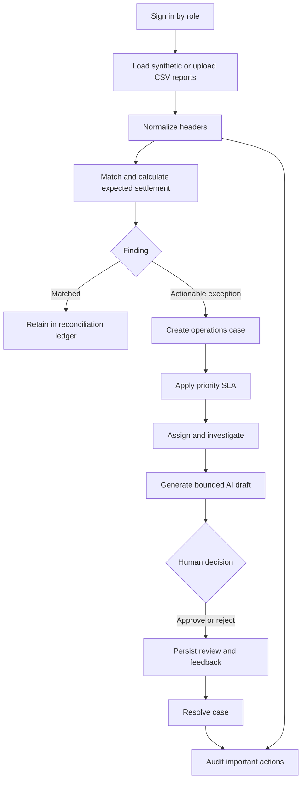

# Product Case Study

## One-line product

PayOps Copilot is an evidence-first reconciliation and case-management
workspace for payment operations teams that compare merchant orders, gateway
transactions, and bank settlements.

## User and job to be done

**Primary user:** a payment operations analyst at an Indian merchant or payment
aggregator.

**Job to be done:** when expected and received payment records differ, help me
find the affected transaction, understand the evidence, assign ownership, and
move it toward resolution before the operational deadline.

Secondary users:

| Persona | Need | Product response |
| --- | --- | --- |
| Operations manager | Know what is overdue and who owns it | SLA dashboard, filters, owners, priorities |
| Risk or control reviewer | Reconstruct what happened | Evidence, human review, audit ledger |
| Read-only stakeholder | Monitor without changing data | Viewer role with disabled mutations |
| Product or engineering team | Improve recurring investigation quality | Structured feedback and persisted investigations |

## Problem

Three reports describe the same payment lifecycle using different fields:

- the internal order file says what should have happened;
- the gateway file says what the processor observed and charged;
- the settlement file says what reached the bank.

Manual comparison creates four product problems:

1. **Schema friction:** the same identifier or amount has different headers.
2. **Exception discovery:** missing, duplicated, or mismatched rows are hard to
   isolate reliably.
3. **Operational follow-through:** spreadsheets do not naturally provide
   ownership, status, SLA, or an investigation record.
4. **AI risk:** a general chatbot may produce a plausible explanation that is
   not supported by the reports.

## Product bet

> If deterministic reconciliation produces a durable evidence bundle, then AI
> can safely accelerate investigation drafting without becoming the system of
> financial truth.

That bet shaped the product into two linked systems:

- a deterministic control plane for normalization, matching, arithmetic,
  persistence, access, SLA, and audit;
- a bounded assistance plane for likely-cause hypotheses, next steps,
  limitations, and provider-message drafts.

## End-to-end journey

## MVP decisions

### Synthetic data first

The repository must be safe to publish. Demo files contain fictional Indian
payment records, and the app does not persist original upload contents.

### Evidence before explanation

Every reconciliation item carries source-derived evidence. The AI assistant is
downstream of this bundle and is instructed not to invent payment events,
policies, provider responses, or money movement.

### Operations, not only analytics

Exceptions automatically become cases. This changes the product from a report
viewer into a work-management system.

### Human authority

AI investigations have pending, approved, or rejected states. User feedback is
persisted so it can later become evaluation data.

### Organization and role boundaries

All protected data access is organization-scoped. Admin and analyst roles can
mutate operations data; viewers cannot. Audit access is admin-only.

## Implemented outcomes

- Reconciliation of three CSV sources with common alias normalization.
- Six result states: matched, mismatch, missing settlement, missing gateway,
  duplicate, and pending.
- PostgreSQL persistence for runs, items, cases, investigations, users, and
  audit events.
- Operations queue with search, status filters, SLA filters, ownership, notes,
  evidence, and AI review.
- Role-aware login and organization-scoped APIs.
- 4/24/72-hour SLA policy with at-risk, overdue, met, and breached states.
- Historical run view and administrator audit ledger.

## Success metrics

The repository does not claim production outcomes. The following are the
metrics a real pilot should measure:

| Metric | Why it matters |
| --- | --- |
| Reconciliation match rate | Baseline data/report quality |
| Exceptions requiring action | Work created by each run |
| Median time to first owner | Queue responsiveness |
| SLA breach rate by priority | Operational control quality |
| Time to resolution | End-to-end operations efficiency |
| AI investigation approval rate | Usefulness with human oversight |
| AI correction and rejection reasons | Input to the evaluation set |
| Repeat exception rate by provider/status | Root-cause prioritization |

## What this project demonstrates

For an AI Product Manager role, the artifact demonstrates:

- translating domain pain into a vertical product workflow;
- separating deterministic systems from probabilistic assistance;
- designing human-in-the-loop controls;
- creating measurable operational states;
- implementing role, organization, and audit requirements;
- using Codex to move across product, database, API, UI, testing, and GitHub
  while retaining human judgment.

## Current limits

- No production payment-provider connection.
- No refund, payout, or money-movement action.
- No business-day or holiday calendar in SLA calculations.
- No outbound email, Slack, or incident notification.
- No enterprise SSO or production secrets system.
- No labeled AI evaluation dataset yet.
- No production telemetry or load testing.

---

[Back to README](../../README.md) |
[Architecture](ARCHITECTURE.md) |
[Roadmap and Trade-offs](ROADMAP-AND-TRADEOFFS.md)
