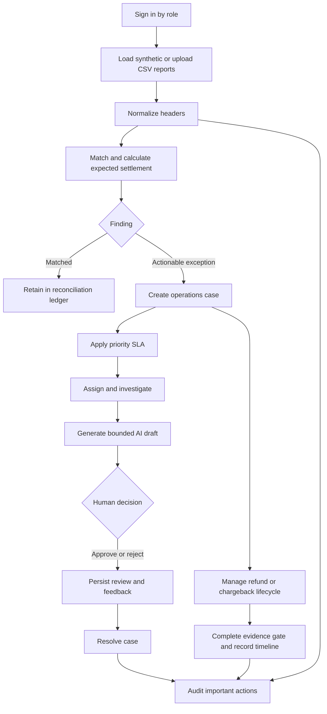

# Product Case Study

## One-line product

PayOps Copilot is an evidence-first reconciliation and settlement-control
workspace for Indian merchant finance teams that need to prove provider
settlements, UTRs, deductions, and bank credits.

## User and job to be done

**Primary user:** a payment operations analyst or finance manager at an Indian
mid-market merchant.

**Job to be done:** when provider settlement evidence and bank credits do not
line up, help me identify the affected orders, explain every deduction, map the
UTR, assign ownership, and decide whether I can close payment books today.

Secondary users:

| Persona | Need | Product response |
| --- | --- | --- |
| Operations manager | Know what is overdue and who owns it | SLA dashboard, filters, owners, priorities |
| Risk or control reviewer | Reconstruct what happened | Evidence, human review, audit ledger |
| Read-only stakeholder | Monitor without changing data | Viewer role with disabled mutations |
| Product or engineering team | Improve recurring investigation quality | Structured feedback and persisted investigations |

Non-primary future users include aggregator risk operations, marketplace
finance, and platform split-settlement teams. Those users need escrow/nodal,
vendor, and split-ledger controls that are intentionally deferred until the
merchant settlement foundation is more credible.

## Problem

Three reports describe the same payment lifecycle using different fields:

- the internal order file says what should have happened;
- the gateway file says what the processor observed and charged;
- the settlement file says what reached the bank.

Manual comparison creates five product problems:

1. **Schema friction:** the same identifier or amount has different headers.
2. **Provider variation:** Razorpay-style, Cashfree-style, PayU-style, and
   generic reports use different field names and status language.
3. **Exception discovery:** missing, duplicated, or mismatched rows are hard to
   isolate reliably.
4. **Operational follow-through:** spreadsheets do not naturally provide
   ownership, status, SLA, or an investigation record.
5. **AI risk:** a general chatbot may produce a plausible explanation that is
   not supported by the reports.

## Product bet

> If deterministic reconciliation produces a durable evidence bundle, then AI
> can safely accelerate investigation drafting without becoming the system of
> financial truth.

That bet shaped the product into two linked systems:

- a deterministic control plane for normalization, matching, arithmetic,
  persistence, access, SLA, and audit;
- a bounded assistance plane for likely-cause hypotheses, next steps,
  limitations, and provider-message drafts.

## End-to-end journey

```mermaid
flowchart TD
    A[Sign in by role] --> B[Load synthetic or upload CSV reports]
    B --> C[Normalize headers]
    C --> D[Match and calculate expected settlement]
    D --> E{Finding}
    E -->|Matched| F[Retain in reconciliation ledger]
    E -->|Actionable exception| G[Create operations case]
    G --> H[Apply priority SLA]
    H --> I[Assign and investigate]
    I --> J[Generate bounded AI draft]
    J --> K{Human decision}
    K -->|Approve or reject| L[Persist review and feedback]
    L --> M[Resolve case]
    G --> O[Manage refund or chargeback lifecycle]
    O --> P[Complete evidence gate and record timeline]
    C --> N[Audit important actions]
    M --> N
    P --> N
```

## MVP decisions

### Synthetic data first

The repository must be safe to publish. Demo files contain fictional Indian
payment records, and the app does not persist original upload contents.

### Evidence before explanation

Every new reconciliation item carries source-derived evidence plus minimal
snapshots of its contributing report rows, including original row numbers,
normalized values, retained source values, and integrity hashes. The AI
assistant is downstream of this bundle and is instructed not to invent payment
events, policies, provider responses, or money movement.

### Operations, not only analytics

Exceptions automatically become cases. This changes the product from a report
viewer into a work-management system.

Cases require a reason, evidence-review confirmation, and resolver attribution
before they can become resolved.

### Human authority

AI investigations have pending, approved, or rejected states. User feedback is
persisted so it can later become evaluation data.

### Organization and role boundaries

All protected data access is organization-scoped. Admin and analyst roles can
mutate operations data; viewers cannot. Audit access is admin-only.

## Implemented outcomes

- Reconciliation of three CSV sources with common alias normalization.
- Synthetic provider adapters for generic, Razorpay-style, Cashfree-style, and
  PayU-style report formats.
- Provider data-quality reporting for mapped fields, unmapped fields, invalid
  amounts, duplicate order references, unknown statuses, and row counts.
- Synthetic provider webhook normalization for payment, settlement, refund, and
  chargeback events.
- HMAC-signed, idempotent synthetic event ingestion with hash-only delivery
  evidence and organization-scoped matching.
- Fictional provider-specific signature contracts with active/previous key
  rotation, timestamp freshness where required, precise rejection evidence,
  and an administrator-only trust ledger.
- In-app provider and SLA notification controls with role-aware read state.
- Manager Operations Intelligence for period trends, queue pressure, SLA
  outcome, provider comparison, AI governance, and evidence-linked drill-down.
- Case and workflow timelines that distinguish what provider events prove from
  what they do not prove.
- Six result states: matched, mismatch, missing settlement, missing gateway,
  duplicate, and pending.
- PostgreSQL persistence for runs, items, cases, investigations, users, and
  audit events.
- Operations queue with search, status filters, SLA filters, ownership, notes,
  evidence, bulk assignment, attributed handoff comments, and AI review.
- Deterministic settlement clocks that prevent premature missing-settlement
  cases and expose provider timing evidence separately from financial truth.
- Daily reconciliation close controls with materiality, residual-risk
  dispositions, immutable snapshot hashes, independent administrator approval,
  controlled reopening, and synthetic certificates.
- Deterministic recurrence detection and governed remediation programs with
  explicit promotion, ownership, implementation evidence, automatic future
  case linking, and administrator verification against two clean runs.
- Role-aware login and organization-scoped APIs.
- 4/24/72-hour SLA policy with at-risk, overdue, met, and breached states.
- Historical run view and administrator audit ledger.
- Versioned 30-case evaluation runs with automated checks, case-level evidence,
  six-score human review, latency, token metadata, and audit attribution.
- Separate refund and chargeback queues with lifecycle transitions, ownership,
  deadlines, evidence gates, notes, and timelines.
- A modular monolith backend with thin API routes, domain services, thirteen
  repositories, and shared PostgreSQL infrastructure.

## Success metrics

The repository does not claim production outcomes. The following are the
metrics a real pilot should measure:

| Metric | Why it matters |
| --- | --- |
| Reconciliation match rate | Baseline data/report quality |
| Exceptions requiring action | Work created by each run |
| Median time to first owner | Queue responsiveness |
| SLA breach rate by priority | Operational control quality |
| Time to resolution | End-to-end operations efficiency |
| AI investigation approval rate | Usefulness with human oversight |
| AI correction and rejection reasons | Input to the evaluation set |
| Repeat exception rate by provider/status | Root-cause prioritization |
| Recurring exposure under open programs | Remediation portfolio priority |
| Verified programs with two clean runs | Evidence of observed improvement |

## What this project demonstrates

For an AI Product Manager role, the artifact demonstrates:

- translating domain pain into a vertical product workflow;
- separating deterministic systems from probabilistic assistance;
- designing human-in-the-loop controls;
- creating measurable operational states;
- implementing role, organization, and audit requirements;
- using Codex to move across product, database, API, UI, testing, and GitHub
  while retaining human judgment.

## Current limits

- No production payment-provider connection.
- No automated daily source-ingestion control plane for late, missing,
  malformed, partial, duplicated, or revised provider/bank files.
- Matching is still MVP-level compared with real layered payment matching
  across order, payment, attempt, payout, UTR, bank, ledger, and split
  identifiers.
- No immutable accounting ledger that can explain opening balance to closing
  merchant payable across collections, fees, GST, refunds, chargebacks, holds,
  releases, payouts, and write-offs.
- No live provider credentials or production export compatibility claim.
- No production provider webhook compatibility, certified signature contract,
  managed secrets system, or provider reliability telemetry.
- No provider-side refund, payout, or money-movement action.
- No business-day or holiday calendar in SLA calculations.
- No outbound email, Slack, or incident notification; alerts are in-app only.
- No enterprise SSO or production secrets system.
- No production-derived or representative two-reviewer evaluation dataset yet.
- No production telemetry or load testing.
- No legal-entity accounting close, bank attestation, or production control
  certification; the close certificate is an internal synthetic snapshot.

---

[Back to README](../../README.md) |
[Architecture](ARCHITECTURE.md) |
[Roadmap and Trade-offs](ROADMAP-AND-TRADEOFFS.md)
